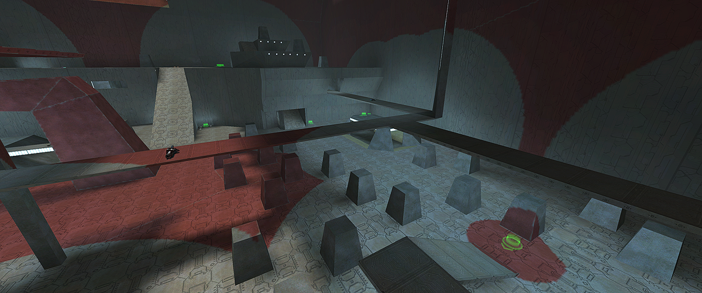

# Spawn camp
Spawn camp is a CLI tool for including spawn visualizations in Halo CE levels, tailored towards the testing of competitive-oriented slayer levels. It is an alternative to the spawn marker injection and randoms geometry generation from [h1-spawn-tools](https://github.com/khstarr/h1-spawn-tools), though spawn simulation and manipulation of spawn points from within Blender are not goals of this project.

Features:

* Render [random spawn locations](https://c20.reclaimers.net/h1/guides/multiplayer/player-spawns#random-spawns) directly into a copy of the level's lightmap. This is fast for quick iteration and has configurable resolution and appearance.
* Place spawn markers in the scenario, updating the scenery palette if needed. By default, this requires that you have the [spawn_marker_nhe](https://github.com/khstarr/h1-spawn-tools/tree/main/tags/spawn-tool-tags/scenery/spawn_marker_nheo) scenery but the scenery tag path is configurable.



## Installation
Download `spawn-camp.exe` from [Releases](https://github.com/csauve/spawn-camp/releases/) and place it in the HEK/Mod Tools folder.

## Usage
[Open a command prompt](https://c20.reclaimers.net/general/command-line/#opening) in your HEK/Mod Tools folder. To render randoms and place markers just give spawn-camp a scenario tag path:

```cmd
spawn-camp levels\test\hangemhigh\hangemhigh
```

This will render a copy of the level's lightmap and update the BSP to reference it, while preserving the original. It will also update the scenario to ensure the spawn marker is placed at every slayer spawn point.

To reset a scenerio to normal and undo the above changes:

```cmd
spawn-camp levels\test\hangemhigh\hangemhigh --reset
```

Various additional options are available:

* `-t, --tags <path>`: Path to the base tags directory. Defaults to `tags`.
* `-m, --marker <tag-path>`: Tag path for the spawn marker scenery. Defaults to `scenery\spawn_marker_nhe\spawn_marker_nhe`.
* `-s, --scale <num>`: Scale for the randoms lightmap compared to Tool's lightmap. Possible values: 1, 2, 4, 8, 16. Defaults to 4. Maps intended for port to Xbox should use 1.
* `-c, --color <hex-code>` RGB(A) hex code for the randoms color. Examples: `FF00FF`, `0FF`, `DDA0DD80`. Defaults to `FF000080`.
* `-w, --walkable`: If provided, only walkable surfaces up to 45 degrees steepness will be shaded with the randoms color.
* `-h, --help` Prints a summary of arguments and options.

For example, to render blue randoms on walkable surfaces with 8x resolution:

```cmd
spawn-camp levels\test\hangemhigh\hangemhigh --color 00f --scale 8 -w
```

## Acknowledgements
* [RingHopper](https://github.com/FishAndRips/ringhopper) by Snowy, MangoFizz, and Aerocatia
* [h1-spawn-tools](https://github.com/khstarr/h1-spawn-tools) by insidi0us
* Spawn marker scenery by stunt_man
* [Vulkano](https://github.com/vulkano-rs/vulkano) project for Vulkan wrapper

## License
GPL v3
